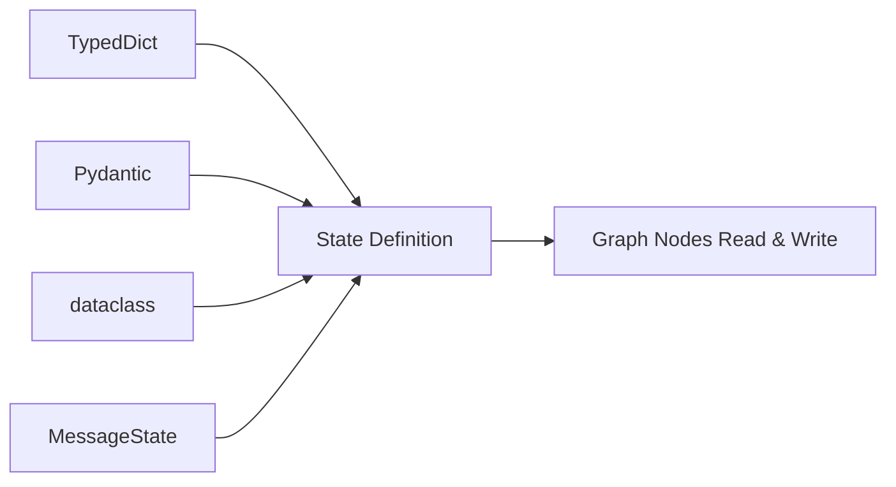
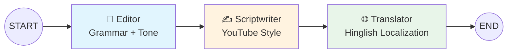
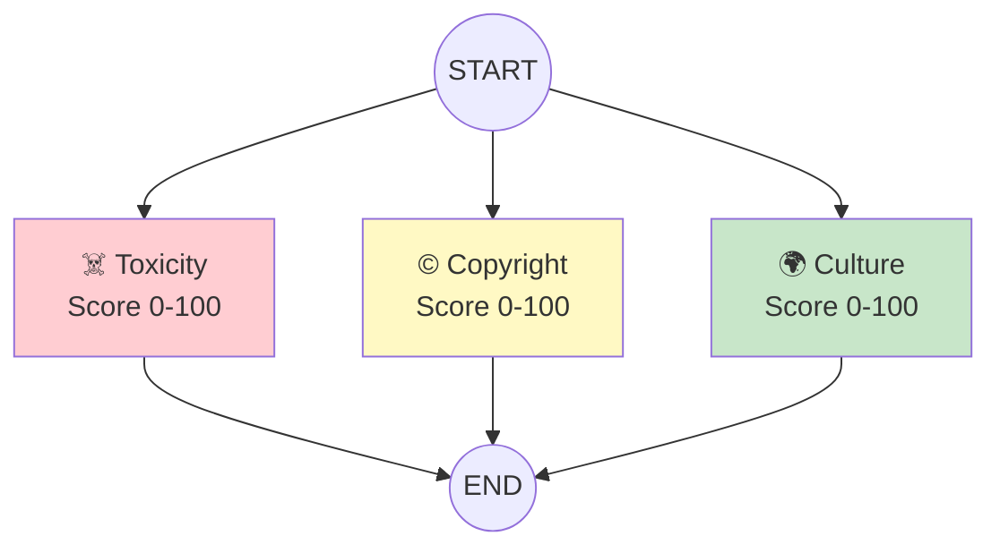
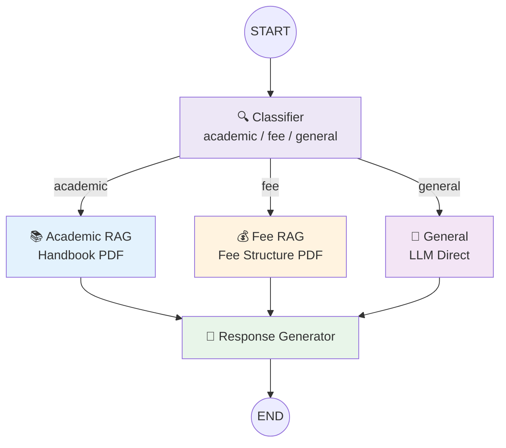
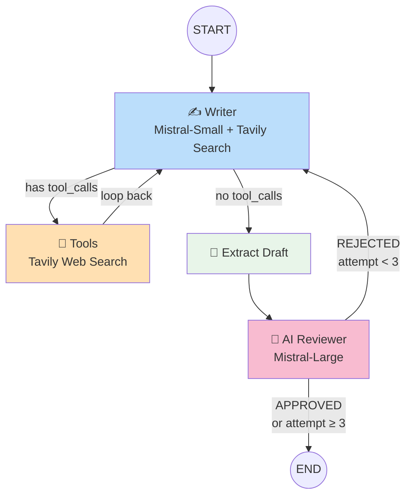
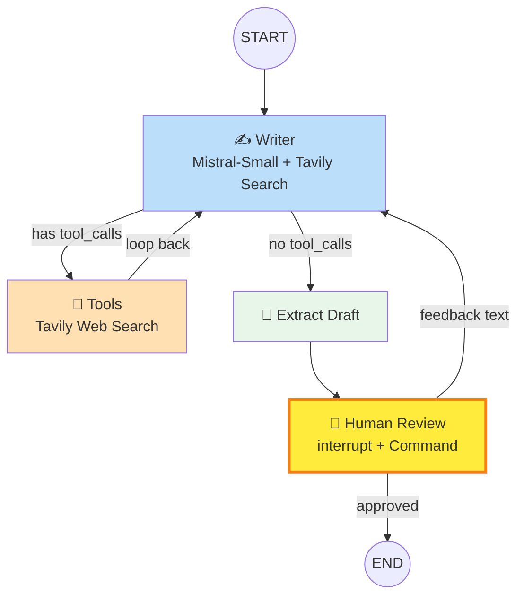
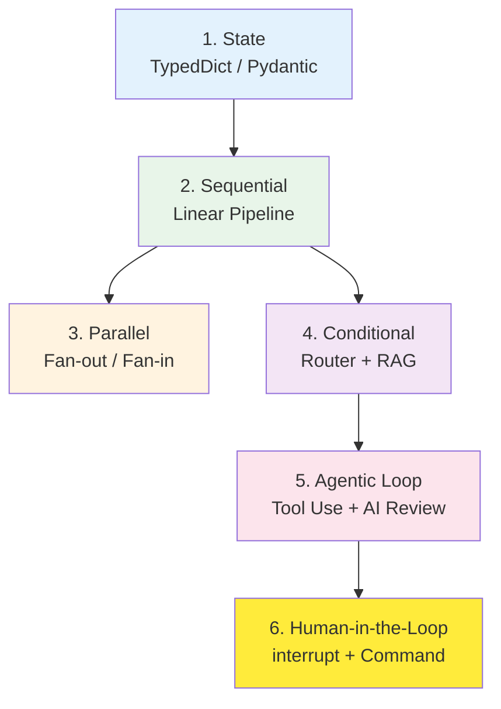

# LangGraph Learning Playground 🧠

A hands-on exploration of **LangGraph** — building LLM-powered stateful workflows step by step, from basic state definitions to advanced human-in-the-loop patterns.

---

## 📦 Project Overview

| File | Concept | What It Teaches |
|------|---------|-----------------|
| `states.py` | **State Definitions** | 4 ways to define graph state in LangGraph |
| `sequential_project.py` | **Sequential Pipelines** | Chaining nodes one after another |
| `parallel_project.py` | **Parallel Execution** | Running multiple nodes simultaneously + fan-in merging |
| `conditional_project.py` | **Conditional Routing** | Branching based on LLM classification + RAG with PDFs |
| `iterative_project.py` | **Agentic Loops** | Tool-calling + AI reviewer loop until quality gate passes |
| `humanintheloop.py` | **Human-in-the-Loop** | Pausing for human approval via `interrupt()` + `Command(resume=...)` |

---

## 🏗️ Architecture & Workflows

### 1. State (`states.py`) — The Foundation

Every LangGraph workflow begins with **state**. This file demonstrates four approaches:

| Approach | Use Case |
|----------|----------|
| **`TypedDict`** | Most common — lightweight, typed, great for simple pipelines |
| **`Pydantic`** | When you need runtime validation (`@field_validator`) |
| **`dataclass`** | Plain Python dataclass with `field(default_factory=...)` |
| **`MessageState`** | LangGraph's built-in state for conversational agents (auto-merges messages) |



---

### 2. Sequential Pipeline (`sequential_project.py`) — Content Factory

A **3-stage linear pipeline** that transforms raw text into a Hinglish video script:



**Key concepts:**
- `StateGraph(pipelineState)` — defining the graph
- `add_node()` + `add_edge()` — wiring nodes sequentially
- `app.invoke()` — running the pipeline with initial state
- Uses **Mistral** (`mistral-small-2603`) for all LLM calls

**State shape:**
```
raw_input → edited_text → scripted_text → final_output
```

---

### 3. Parallel Execution (`parallel_project.py`) — Content Safety Analyzer

Runs **three independent safety checks simultaneously** and merges results:



**Key concepts:**
- **Fan-out**: Multiple edges from `START` to parallel nodes
- **Fan-in**: Custom reducer `merge_score_dicts()` merges partial results with `Annotated[dict, reducer]`
- All three branches execute concurrently, results auto-merge at `END`

---

### 4. Conditional Routing (`conditional_project.py`) — College Assistant RAG Bot

An **intelligent chatbot** that classifies student queries and routes to the right knowledge base:



**Key concepts:**
- **RAG pipeline**: PDF → `PyPDFLoader` → `RecursiveCharacterTextSplitter` → `FAISS` vector store → retriever
- **Conditional edges**: `add_conditional_edges("classifier", route_query)` with a router function returning `Literal["academic_rag", "fee_rag", "general"]`
- **Interactive CLI**: Programme selection + continuous chat loop
- **Programme-aware responses**: Personalizes answers based on student's programme (BCA/BBA/B.Com)

---

### 5. Agentic Loop (`iterative_project.py`) — LinkedIn Post Generator with AI Reviewer

A **self-improving agent** that writes, reviews, and rewrites until quality passes:



**Key concepts:**
- **Tool calling**: Writer binds `TavilySearch` for real-time web research
- **Two-model setup**: `mistral-small` (writer, fast) + `mistral-large` (reviewer, strict)
- **ReAct loop**: Writer ↔ Tools cycle until draft is ready, then Reviewer ↔ Writer loop (max 3 attempts)
- **Conditional routing**: `should_use_tool` checks for `tool_calls` attribute; `should_stop_looping` gates on `is_approved` and `attempt` count

---

### 6. Human-in-the-Loop (`humanintheloop.py`) — LinkedIn Post Generator with Manual Approval

The same LinkedIn generator, but **you** are the reviewer:



**Key concepts:**
- **`interrupt()`**: Pauses graph execution and surfaces the draft to the user
- **`Command(resume=...)`**: Resumes the graph with human input (approval or revision feedback)
- **`MemorySaver`**: Checkpoints graph state so it survives the pause
- **`config` with `thread_id`**: Ties checkpoints to a conversation thread
- **Loop detection**: `while "__interrupt__" in result` — polls for interrupts until graph completes

---

## 🔄 Concept Progression Map



Each project builds on the previous one — state → edges → routing → loops → human interaction.

---

## 🛠️ Tech Stack

| Category | Tools |
|----------|-------|
| **Orchestration** | LangGraph (`StateGraph`, `START`, `END`, `interrupt`, `Command`) |
| **LLM** | Mistral (`mistral-small-2603`, `mistral-large-2512`) via `langchain-mistralai` |
| **Embeddings** | Mistral Embed (`mistral-embed`) |
| **Vector Store** | FAISS (in-memory) |
| **RAG** | `PyPDFLoader`, `RecursiveCharacterTextSplitter`, `FAISS` retriever |
| **Web Search** | Tavily Search API (`langchain_tavily`) |
| **Checkpointing** | `MemorySaver` (in-memory state persistence) |
| **Validation** | Pydantic `@field_validator` |

---

## 🚀 Getting Started

```bash
# Install dependencies
pip install -r requirements.txt
# or
uv sync

# Set up environment variables
cp .env.example .env
# Add your MISTRAL_API_KEY and TAVILY_API_KEY

# Run any project
python sequential_project.py
python parallel_project.py
python conditional_project.py
python iterative_project.py
python humanintheloop.py
```

---

## 📚 Key Learnings

1. **State is everything** — TypedDict for simple, Pydantic for validation, `Annotated[dict, reducer]` for merging parallel results
2. **Edges define flow** — `add_edge` for deterministic paths, `add_conditional_edges` for branching
3. **Reducers enable parallelism** — custom merge functions let multiple nodes write to the same state key safely
4. **RAG + routing = smart bots** — classify intent, then retrieve from the right knowledge base
5. **Tool binding enables agents** — `llm.bind_tools()` + `ToolNode` creates ReAct loops
6. **`interrupt()` + `Command` = human in control** — pause, show results, wait for approval, resume with feedback
